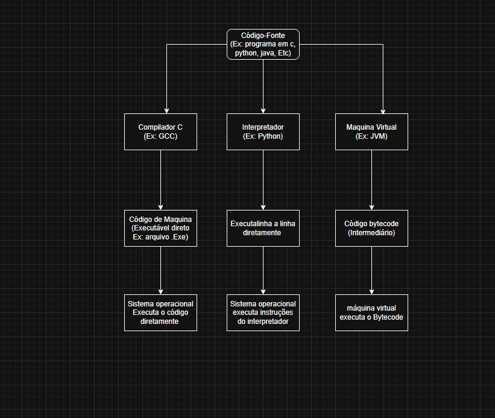
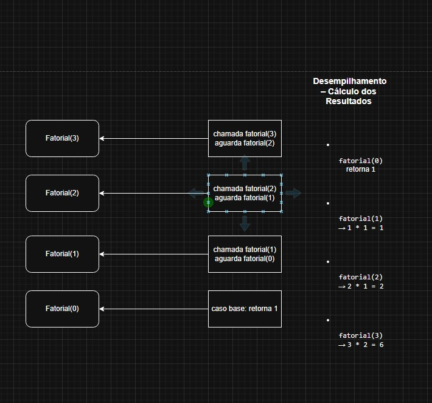
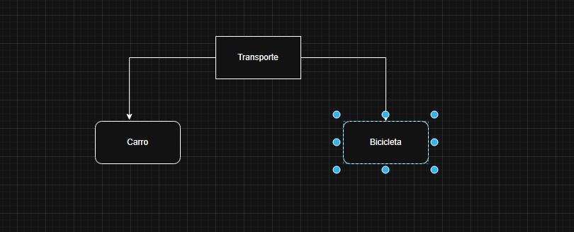

# Trabalho-de-Linguagem-de-Programa-o
Fundamentos-Linguagens-UFC/
│
├── README.md                         
Este repositório reúne a resolução dos 14 desafios propostos na disciplina de Linguagens de Programação, com foco na aplicação prática dos principais conceitos estudados ao longo do curso.
Cada desafio aborda um tema fundamental da área, explorado de forma autorais, criativa e contextualizada, utilizando diferentes linguagens de programação e formas de apresentação, como textos explicativos, códigos, diagramas, quadros comparativos e scripts.

├── 01-introducao/                      --> README.md com linha do tempo da evolução das linguagens
# Linha do Tempo da Evolução das Linguagens de Programação

| Ano   | Linguagem        | Descrição                                                                                     |
|-------|------------------|-----------------------------------------------------------------------------------------------|
| 1957  | 🧮 Fortran       | Primeira linguagem de alto nível, criada para cálculos científicos e engenharia.              |
| 1958  | 🔷 Lisp          | Pioneira em programação funcional e inteligência artificial, com manipulação de listas.      |
| 1959  | 🏦 COBOL         | Voltada para aplicações comerciais e bancárias, muito usada em sistemas legados.              |
| 1964  | 🧠 BASIC         | Desenvolvida para ensino e iniciantes, facilitou a popularização da programação.              |
| 1967  | 🔶 Simula        | Introduziu o paradigma orientado a objetos, base para linguagens como C++ e Java.             |
| 1970  | 📚 Pascal        | Foco em boas práticas e ensino estruturado da programação.                                   |
| 1972  | 🧱 C             | Base para sistemas operacionais como Unix, influenciou muitas linguagens modernas.            |
| 1978  | ⚙️ Prolog        | Linguagem lógica para inteligência artificial e processamento simbólico.                     |
| 1980  | 🔄 Smalltalk     | Uma das primeiras linguagens orientadas a objetos puras, influenciou Python e Ruby.          |
| 1983  | 🧩 C++           | Extensão do C com suporte a orientação a objetos e software de alto desempenho.               |
| 1987  | 🧵 Perl          | Linguagem de script para automação, processamento de texto e web.                            |
| 1991  | 🐍 Python       | Simples, legível e versátil, usada em ciência de dados, IA, automação e web.                  |
| 1993  | 🔥 Ruby          | Focada em simplicidade e produtividade, linguagem orientada a objetos, popular com Rails.    |
| 1995  | ☕ Java          | “Escreva uma vez, rode em qualquer lugar”. Popular em sistemas empresariais e Android.       |
| 1995  | 🌐 JavaScript    | Linguagem para interação web, hoje também usada no backend com Node.js.                      |
| 1995  | 💾 PHP           | Linguagem server-side para desenvolvimento web dinâmico.                                    |
| 2000  | 🧿 C#            | Criada pela Microsoft para o .NET, usada em aplicações desktop, web e jogos.                  |
| 2001  | 🐦 Objective-C   | Popular para desenvolvimento de apps Apple antes do Swift.                                  |
| 2009  | 🚀 Go            | Desenvolvida pelo Google, ideal para sistemas concorrentes e servidores eficientes.           |
| 2010  | 🔒 Rust          | Segurança de memória e alta performance sem coletor de lixo.                                 |
| 2011  | 💎 Kotlin        | Compatível com Java, mais concisa e segura, oficial para Android.                            |
| 2014  | 🍎 Swift         | Moderna e segura, substitui Objective-C no ecossistema Apple.                                |
| 2015  | 📦 TypeScript    | Superset do JavaScript que adiciona tipagem estática opcional.                               |
| 2020+ | 🌟 Tendências Emergentes | Elixir, Zig, Crystal, Julia e outras ganham espaço com foco em segurança, concorrência e produtividade. |

├── 02-ambientes/                       --> README.md + diagramas de compiladores, interpretadores e VMs
│

├── 03-sintaxe-semantica/              --> README.md + mini-gramática fictícia com análise léxica
│
🌱 Linguagem Inventada: MinimaLang

Uma linguagem criada pra ser fácil de entender até pra quem nunca programou. Só 3 comandos principais: guardar, mostrar e somar.

Regras da Linguagem
guarda nome tipo → declara uma variável (tipo pode ser número ou texto)

nome recebe valor → atribui valor à variável

mostra nome → exibe a variável

soma nome1 e nome2 → soma duas variáveis numéricas

SomaNome = nome1 + Nome2 

mostra nome = SomaNome

├── 04-tipos-de-dados/                 --> README.md + comparativo entre tipos de dados em 3 linguagens
│
📚 Tipos de Dados: Comparando C, Java e C#

🔹 Linguagem C

A linguagem C possui tipagem estática, ou seja, os tipos das variáveis são definidos em tempo de compilação. No entanto, sua tipagem é considerada fraca, pois permite muitas conversões implícitas entre tipos diferentes, mesmo que isso possa causar comportamentos inesperados ou erros de execução. Por exemplo, é possível forçar a conversão de uma string para um inteiro com type casting, mesmo que o valor não seja compatível.

🔹 Linguagem Java

Java utiliza tipagem estática e forte. Os tipos das variáveis devem ser declarados, e o compilador verifica se os tipos estão corretos antes de rodar o programa. Não permite conversões implícitas arriscadas. Se você tentar atribuir uma string a uma variável inteira, o código nem vai compilar. Isso torna o código mais seguro e previsível.

🔹 Linguagem C#

C# também possui tipagem estática e forte, mas oferece uma sintaxe mais moderna com suporte a inferência de tipo por meio da palavra-chave var. Mesmo com var, o tipo ainda é determinado em tempo de compilação e não pode ser alterado depois. Como em Java, conversões implícitas perigosas não são permitidas.

├── 05-estruturas-de-controle/         --> README.md + código com estruturas de controle em contexto original
│

#include <stdio.h>

int main() {
    int numeroSecreto = 7;  // número fixo para simplificar
    int palpite;

    printf("Jogo de Adivinhacao\n");
    printf("Tente adivinhar o numero entre 1 e 10.\n");
    printf("Digite 0 para desistir.\n\n");

    while (1) {
        printf("Seu palpite: ");
        scanf("%d", &palpite);

        if (palpite == 0) {
            printf("Voce desistiu do jogo. Ate mais!\n");
            break;  // sai do loop
        }

        if (palpite < 1 || palpite > 10) {
            printf("Palpite invalido. Tente um numero entre 1 e 10.\n");
            continue; // volta para o começo do loop
        }

        if (palpite == numeroSecreto) {
            printf("Parabens! Voce acertou o numero secreto!\n");
            break;  // termina o jogo
        } else if (palpite < numeroSecreto) {
            printf("O numero secreto e maior. Tente de novo.\n");
        } else {
            printf("O numero secreto e menor. Tente de novo.\n");
        }
    }

    return 0;
}

├── 06-subprogramas/                   --> README.md + funções com passagem por valor e referência
│
1. Passagem por referência em C (com ponteiro)
c
Copiar
Editar
#include <stdio.h>

// Função que troca o valor de duas variáveis usando ponteiros (passagem por referência)
void troca(int *a, int *b) {
    int temp = *a;
    *a = *b;
    *b = temp;
}

int main() {
    int x = 5, y = 10;

    printf("Antes da troca: x = %d, y = %d\n", x, y);
    troca(&x, &y);
    printf("Depois da troca: x = %d, y = %d\n", x, y);

    return 0;
}
Explicação:
Aqui, a função troca recebe os endereços (&x e &y), então ela consegue alterar diretamente os valores das variáveis originais — isso é passagem por referência em C.

2. Passagem por valor em Java (para tipos primitivos)
java
Copiar
Editar
public class PassagemPorValor {
    
    // Função que tenta trocar os valores, mas não altera os originais
    public static void troca(int a, int b) {
        int temp = a;
        a = b;
        b = temp;
        System.out.println("Dentro da função troca: a = " + a + ", b = " + b);
    }

    public static void main(String[] args) {
        int x = 5;
        int y = 10;

        System.out.println("Antes da troca: x = " + x + ", y = " + y);
        troca(x, y);
        System.out.println("Depois da troca: x = " + x + ", y = " + y);
    }
}
Explicação:
Aqui, troca recebe cópias dos valores de x e y. Alterar a e b dentro da função não muda x e y no main, pois Java passa parâmetros por valor para tipos primitivos.

├── 07-implementacao-subprogramas/     --> README.md + explicação e desenho da pilha de chamadas (recursão)
│

🧮 Código Base
python

def fatorial(n):

    if n == 0:

        return 1

    else:

        return n * fatorial(n - 1)

fatorial(3)

Resultado Final
python

fatorial(3) → 6

├── 08-orientacao-objetos/             --> README.md + modelagem de classes com herança e polimorfismo
│

🚗 Hierarquia: Transporte → Carro / Bicicleta
java

// Classe base
public class Transporte {
    protected String marca;
    protected String modelo;

    public Transporte(String marca, String modelo) {
        this.marca = marca;
        this.modelo = modelo;
    }

    public void mover() {
        System.out.println(marca + " " + modelo + " está se movendo.");
    }
}

public class Carro extends Transporte {
    private int portas;

    public Carro(String marca, String modelo, int portas) {
        super(marca, modelo);
        this.portas = portas;
    }

    @Override
    public void mover() {
        System.out.println("O carro " + marca + " " + modelo + " está dirigindo na estrada.");
    }
}

public class Bicicleta extends Transporte {
    private int marchas;

    public Bicicleta(String marca, String modelo, int marchas) {
        super(marca, modelo);
        this.marchas = marchas;
    }

    @Override
    public void mover() {
        System.out.println("A bicicleta " + marca + " " + modelo + " está pedalando.");
    }
}

public class Main {
    public static void main(String[] args) {
        Carro carro = new Carro("Toyota", "Corolla", 4);
        Bicicleta bike = new Bicicleta("Caloi", "Elite", 21);

        carro.mover(); // O carro Toyota Corolla está dirigindo na estrada.
        bike.mover();  // A bicicleta Caloi Elite está pedalando.
    }
}

├── 09-concorrencia/                   --> README.md + explicação de threads/processos + exemplo prático
│

Diferença entre processos e threads

Um processo é um programa que está em execução, com seu próprio espaço de memória isolado. Já uma thread é uma unidade menor de execução dentro do processo, que compartilha a mesma memória com as outras threads do mesmo processo. Por isso, criar e gerenciar threads é mais leve do que criar processos.

Outra diferença importante é que a comunicação entre processos é mais complexa e lenta, enquanto threads conseguem compartilhar informações de forma direta porque estão no mesmo espaço de memória. Porém, como as threads compartilham memória, um problema em uma pode afetar o funcionamento das outras.

Exemplo prático de concorrência usando threads em Java
Aqui tem um exemplo simples em que duas threads executam tarefas diferentes ao mesmo tempo:

public class ConcorrenciaExemplo {

    public static void main(String[] args) {

        Thread thread1 = new Thread(() -> {
            for (int i = 1; i <= 5; i++) {
                System.out.println("Thread 1: " + i);
                try {
                    Thread.sleep(500);
                } catch (InterruptedException e) {
                    e.printStackTrace();
                }
            }
        });

        Thread thread2 = new Thread(() -> {
            for (char c = 'A'; c <= 'E'; c++) {
                System.out.println("Thread 2: " + c);
                try {
                    Thread.sleep(700);
                } catch (InterruptedException e) {
                    e.printStackTrace();
                }
            }
        });

        thread1.start();
        thread2.start();

        try {
            thread1.join();
            thread2.join();
        } catch (InterruptedException e) {
            e.printStackTrace();
        }

        System.out.println("Execução finalizada.");
    }
}

Neste código, a primeira thread imprime números de 1 a 5 e a segunda imprime letras de A a E. Como elas rodam ao mesmo tempo, as mensagens aparecem misturadas na saída, mostrando a concorrência. O programa só termina depois que as duas threads terminam suas tarefas.

├── 10-gerenciamento-memoria/          --> README.md + quadro comparativo entre dois modelos de memória
│

├── 11-programacao-funcional/          --> README.md + código com recursão e funções de alta ordem
│

├── 12-programacao-logica/             --> README.md + problema lógico modelado em estilo Prolog
│

├── 13-scripts-web/                    --> README.md + script de automação ou manipulação de dados
│

└── 14-tendencias/                     --> README.md + análise crítica sobre linguagem emergente

